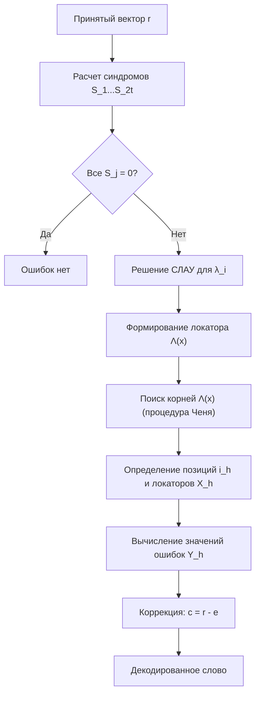

Обработка и интерпретация сигналов
**Тема:** Коды Рида–Соломона и недвоичные циклические коды БЧХ

---

## 1. Переход от двоичных к недвоичным кодовым конструкциям

В классических **двоичных кодах БЧХ** обработка ведется на уровне отдельных битов ($0$ и $1$). Однако современные системы передачи данных часто задействуют **недвоичную модуляцию**, а физические каналы связи подвержены возникновению **пакетов ошибок** (групповых искажений).

**Коды Рида–Соломона (РС)** представляют собой класс недвоичных циклических кодов, являющихся расширением кодов БЧХ над полем $GF(q)$, где $q=2^m$. Их основные эксплуатационные характеристики:
- **Устойчивость к пакетам ошибок:** искажение нескольких бит внутри одного символа (например, байта) интерпретируется алгоритмом как **одна** символьная ошибка.
- **Оптимальность структуры:** коды обладают максимально возможным минимальным расстоянием для заданного объема избыточности.
- **Эффективность использования полосы:** достижение границы Синглтона делает их наиболее мощными среди линейных кодов при фиксированных параметрах $(n, k)$.

---

## 2. Математический аппарат и структурные параметры

### 2.1. Алфавит и циклическая структура в поле Галуа

Код строится над расширенным полем Галуа $GF(q)$, где $q = p^m$ (в цифровой связи практически всегда $p=2$). 
**Длина кодового слова** ограничена мощностью поля: $n = q - 1$.
> Построение базируется на свойствах циклической группы, образованной ненулевыми элементами поля. Каждая позиция в векторе кодового слова ассоциируется с определенной степенью примитивного элемента $\alpha^i$.

### 2.2. Порождающий многочлен

В отличие от двоичных БЧХ-кодов, где порождающий полином $g(x)$ является произведением минимальных многочленов (степень которых может быть $>1$), в кодах Рида–Соломона все корни лежат в исходном поле $GF(q)$. Следовательно, каждый множитель имеет первую степень.

Математическая форма записи $g(x)$:

$$
g(x) = (x - \alpha^{b})(x - \alpha^{b+1}) \cdots (x - \alpha^{b+d-2}),
$$

Где используются следующие параметры:
- $\alpha$: примитивный элемент поля $GF(q)$;
- $b$: смещение индексов корней (традиционно принимается $b=1$);
- $d$: конструктивное расстояние (минимальное кодовое расстояние).

**Свойства избыточности:** Степень многочлена $g(x)$ равна количеству проверочных символов $n - k = d - 1$. Отсюда вытекает фундаментальное соотношение для кодов РС: $k = n - d + 1$.

### 2.3. MDS-свойство и граница Синглтона

Для произвольного линейного блокового кода $(n,k,d)$ выполняется фундаментальное ограничение:

$$
d \le n - k + 1.
$$

Коды Рида–Соломона являются **максимально разделимыми** (Maximum Distance Separable, **MDS**), так как они обращают это неравенство в строгое равенство. Это означает, что любой поднабор из $k$ символов кодового слова позволяет однозначно восстановить исходную информацию.

---

## 3. Практическая реализация кода над полем $GF(2^4)$

### 3.1. Структура поля $GF(16)$

Поле строится на основе примитивного многочлена $p(x) = 1 + x + x^4$. 
Условие $\alpha^4 = 1 + \alpha$ определяет правила умножения и сложения элементов:

| Степень $\alpha^k$ | Полиномиальное представление | Векторное представление (коэф. $1,x,x^2,x^3$) |
|--------------------|-------------------------------|----------------------------------------------|
| $0$                | $1$                           | $0001$                                       |
| $1$                | $\alpha$                      | $0010$                                       |
| $2$                | $\alpha^2$                    | $0100$                                       |
| $3$                | $\alpha^3$                    | $1000$                                       |
| $4$                | $1+\alpha$                    | $0011$                                       |
| $5$                | $\alpha+\alpha^2$             | $0110$                                       |
| $6$                | $\alpha^2+\alpha^3$           | $1100$                                       |
| $7$                | $1+\alpha+\alpha^3$           | $1011$                                       |
| $8$                | $1+\alpha^2$                  | $0101$                                       |
| $9$                | $\alpha+\alpha^3$             | $1010$                                       |
| $10$               | $1+\alpha+\alpha^2$           | $0111$                                       |
| $11$               | $\alpha+\alpha^2+\alpha^3$    | $1110$                                       |
| $12$               | $1+\alpha+\alpha^2+\alpha^3$  | $1111$                                       |
| $13$               | $1+\alpha^2+\alpha^3$         | $1101$                                       |
| $14$               | $1+\alpha^3$                  | $1001$                                       |

### 3.2. Конфигурация $(15,11)$ с исправительной способностью $t=2$

Параметры: $b=1$, $d=5$. Корнями $g(x)$ являются $\alpha^1, \alpha^2, \alpha^3, \alpha^4$.

$$
g(x) = (x+\alpha)(x+\alpha^2)(x+\alpha^3)(x+\alpha^4).
$$

*(Учитывая характеристику поля 2, операции вычитания и сложения эквивалентны).* Степень полинома равна $4$, что подтверждает число информационных символов $k = 15 - 4 = 11$.

### 3.3. Конфигурация $(15,9)$ с исправительной способностью $t=3$

При $n=15$ и $d=7$ код способен корректировать до 3-х символьных ошибок.
Порождающий полином включает 6 корней:

$$
g(x) = \prod_{j=1}^{6} (x + \alpha^j) = (x+\alpha)(x+\alpha^2)(x+\alpha^3)(x+\alpha^4)(x+\alpha^5)(x+\alpha^6).
$$

---

## 4. Алгоритмическая база декодирования: метод Питерсона–Горнстейна–Зирлера (PGZ)

Алгоритм предназначен для нахождения локаторов и значений ошибок при условии, что их количество $\nu$ не превышает $t = \lfloor (d-1)/2 \rfloor$.

### 4.1. Формирование синдромного вектора

Принятый многочлен $r(x) = c(x) + e(x)$ проверяется на корнях порождающего полинома. Синдромы $S_j$ определяются как:

$$
S_j = r(\alpha^{b+j-1}) = e(\alpha^{b+j-1}), \qquad j = 1,2,\dots, d-1.
$$

Если все $S_j = 0$, делается вывод об отсутствии ошибок.

### 4.2. Аналитическое описание позиций и весов ошибок

Предположим наличие $\nu$ ошибок в позициях $i_1, i_2, \dots, i_\nu$.
- **Локаторы ошибок:** $X_h = \alpha^{i_h}$ — определяют "где" произошла ошибка.
- **Значения (веса) ошибок:** $Y_h$ — определяют "какое" значение нужно добавить для коррекции.

Система синдромных уравнений принимает вид:

$$
S_j = \sum_{h=1}^{\nu} Y_h X_h^{\,j}, \qquad j = 1,2,\dots, d-1.
$$

### 4.3. Полином локатора ошибок $\Lambda(x)$

Для нахождения неизвестных $X_h$ вводится вспомогательная функция:

$$
\Lambda(x) = \prod_{h=1}^{\nu} (1 - X_h x) = 1 + \lambda_1 x + \lambda_2 x^2 + \dots + \lambda_\nu x^\nu.
$$

Корнями этого полинома являются величины, обратные локаторам ошибок ($X_h^{-1}$).

### 4.4. Решение ключевого уравнения декодирования

Коэффициенты $\lambda_i$ определяются из системы линейных уравнений (уравнения Ньютона), связывающих синдромы и коэффициенты локатора:
```math
$$
\begin{pmatrix}
S_1 & S_2 & \cdots & S_\nu \\
S_2 & S_3 & \cdots & S_{\nu+1} \\
\vdots & \vdots & \ddots & \vdots \\
S_\nu & S_{\nu+1} & \cdots & S_{2\nu-1}
\end{pmatrix}
\begin{pmatrix}
\lambda_\nu \\
\lambda_{\nu-1} \\
\vdots \\
\lambda_1
\end{pmatrix}
=
\begin{pmatrix}
-S_{\nu+1} \\
-S_{\nu+2} \\
\vdots \\
-S_{2\nu}
\end{pmatrix}
$$
```
### 4.5. Пошаговая процедура PGZ

1.  **Вычисление синдромов:** расчет значений $S_1 \dots S_{2t}$ над $GF(q)$.
2.  **Оценка числа ошибок:** определение ранга синдромной матрицы для нахождения $\nu$.
3.  **Поиск коэффициентов $\lambda_i$:** решение СЛАУ методом Гаусса в поле Галуа.
4.  **Поиск корней (процедура Ченя):** циклический перебор элементов поля для нахождения $X_h$.
5.  **Определение весов (алгоритм Форни):** решение системы для $Y_h$ (либо использование упрощенных формул).
6.  **Финальная коррекция:** вычитание (XOR для $p=2$) векторов ошибок из принятого сообщения.

---

## 5. Функциональная схема процесса декодирования



---

## 6. Компаративный анализ: БЧХ vs Рид–Соломон

| Параметр сравнения | Двоичные коды БЧХ | Коды Рида–Соломона |
| :--- | :--- | :--- |
| **Элементарная единица** | Бит $\{0, 1\}$ | Символ поля $GF(2^m)$ |
| **Максимальная длина** | $n = 2^m - 1$ | $n = 2^m - 1$ |
| **Затраты избыточности** | $n-k \approx m \cdot t$ | $n-k = 2t$ (строго) |
| **Минимальное расстояние** | $d \ge 2t+1$ | $d = 2t+1$ (всегда) |
| **Классификация** | Обычный линейный код | **MDS-код** (наивысшая плотность) |
| **Профиль помехоустойчивости** | Одиночные инверсии бит | Пакетные и групповые ошибки |
| **Пример (t=2, n=15)** | $(15, 7)$ — нужно 8 бит проверки | $(15, 11)$ — нужно 4 символа проверки |

---
